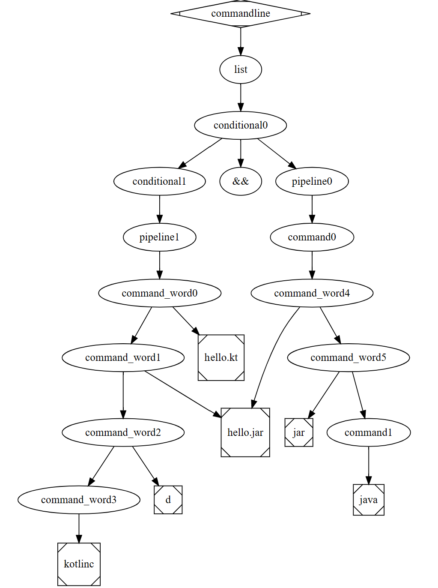
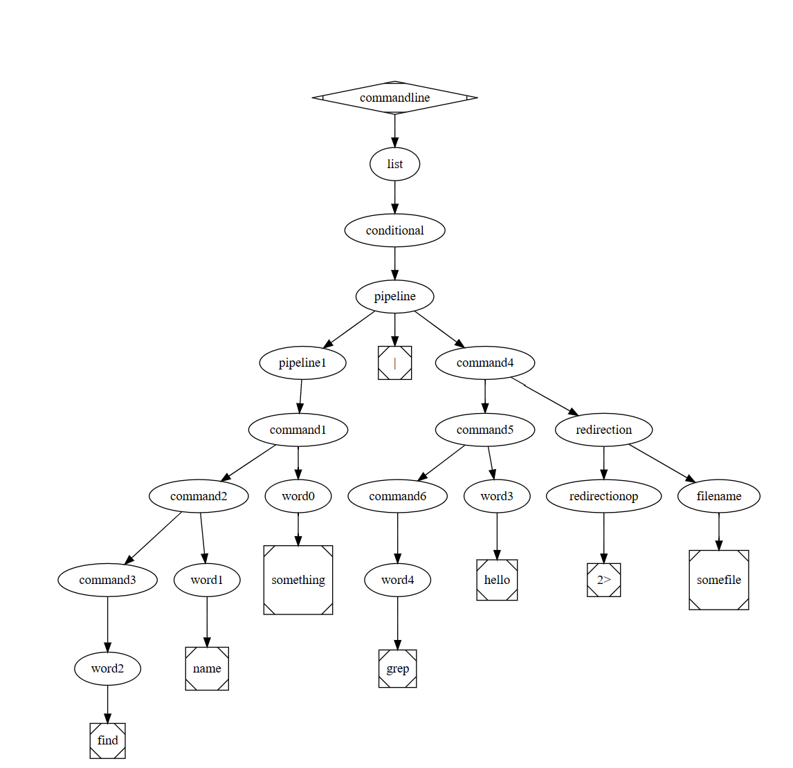

# Assignment 6 - Kotlin

The program takes in a single command line argument to create key and value pairs to be mappped from a file containing names.
Should continue through mapping through the key-value pairs of the text file till "crtl+d" is identified as an input to cancel the program.

## Setup

The Kotlin program will be run using `kotlinc`

## Running

From the command line - using jar file:
```
kotlinc -d hw6.jar -include-runtime hw6.kt 
java -jar hw6.jar fileName.txt
```

## Notes
Program will not terminate once cntl-d is pressed: 
- Was working on Windows; don't know if this would effect this from working as instructed. Was able to stop process once cntl-z or cntl-c was entered.

## Part2 of Assignment 6
## 2a
Production  | Deriation       
----------  | ----------------
1 | list
2 | conditional
3 | conditional "&&" pipeline
4 | pipeline "&&" pipeline
5 | command "&&" pipeline
6 | command word "&&" pipeline
6 | command word "hello.kt" "&&" pipeline
6 | command word "hello.kt" "&&" pipeline
6 | command word "hello.jar" "hello.kt" "&&" pipeline
6 | command "d" "hello.jar" "hello.kt" "&&" pipeline
6 | word "d" "hello.jar" "hello.kt" "&&" pipeline
6 | "kotlinc" "d" "hello.jar" "hello.kt" "&&" pipeline
4 | "kotlinc" "d" "hello.jar" "hello.kt" "&&" command
6 | "kotlinc" "d" "hello.jar" "hello.kt" "&&" command word
6 | "kotlinc" "d" "hello.jar" "hello.kt" "&&" command word "hello.jar"
6 | "kotlinc" "d" "hello.jar" "hello.kt" "&&" command jar hello.jar
6 | "kotlinc" "d" "hello.jar" "hello.kt" "&&" word jar hello.jar
6 | kotlinc d hello.jar hello.kt "&&" java jar hello.jar



## 2b
Production  | Deriation       
----------  | ----------------
1 | list
2 | conditional
3 | pipeline
4 | pipeline \| command
5 | command word \| command
5 | command word "something" \| command
5 | word "name" "something" \|\ command
5 | "find" name something \| command
5 | "find" "name" "something" \| command redirection
6 | "find" "name" "something" \| command redirectionop filename
5 | "find" "name" "something" \| command word redirectionop filename
5 | "find" "name" "something" \| word "hello" redirectionop filename
5 | "find" "name" "something" \| "grep" "hello" redirectionop filename
6 | "find" "name" "something" \| "grep" "hello" redirectionop filename
7 | "find" "name" "something" \| "grep" "hello" "2>" "somefile"

